# AI 辅助 e2e 测试编写实战

> 基于 Claude Code Skills 和 Playwright 的测试开发最佳实践

---

## 目录

1. [项目背景与测试挑战](#第一部分项目背景与测试挑战)
2. [AI 辅助学习 Playwright](#第二部分ai-辅助学习-playwright)
3. [Skill 系统化测试开发](#第三部分skill-系统化测试开发)
4. [完整测试开发流程演示](#第四部分完整测试开发流程演示)
5. [最佳实践与经验总结](#第五部分最佳实践与经验总结)
6. [未来展望](#第六部分未来展望)

---

## 核心流程图

### AI 辅助测试开发整体流程

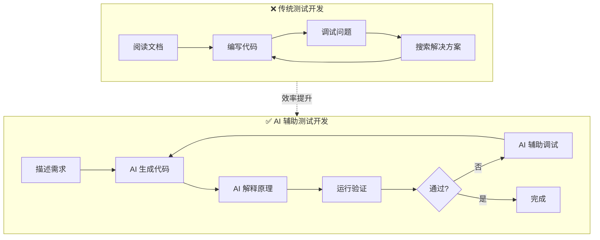

### Skill 工作流程

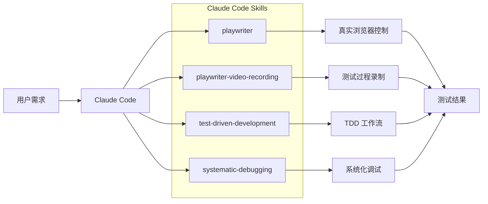

### 测试开发周期

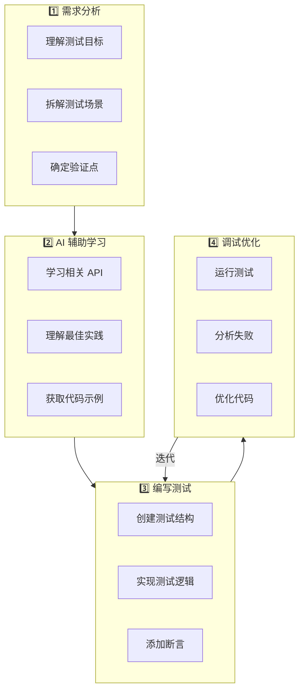

---

## 第一部分：项目背景与测试挑战

### 1.1 项目介绍

本项目是一个**智能体检测平台（TBox）**的 e2e 测试框架，具有以下特点：

- 多平台支持（支付宝 H5、原生环境）
- 复杂的 bridgeAPI 交互
- 需要验证 URL 参数、API 响应、UI 渲染

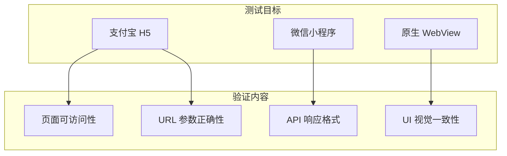

### 1.2 传统测试开发的痛点

| 痛点 | 描述 | 影响 |
|------|------|------|
| 学习曲线陡峭 | Playwright API 众多，难以快速上手 | 开发效率低 |
| 编写繁琐 | 选择器、断言、等待逻辑重复 | 代码冗余 |
| 缺乏最佳实践 | 不知道如何组织测试结构 | 维护困难 |
| 调试困难 | 问题难以定位和复现 | 排查耗时 |

### 1.3 引入 AI 辅助的动机

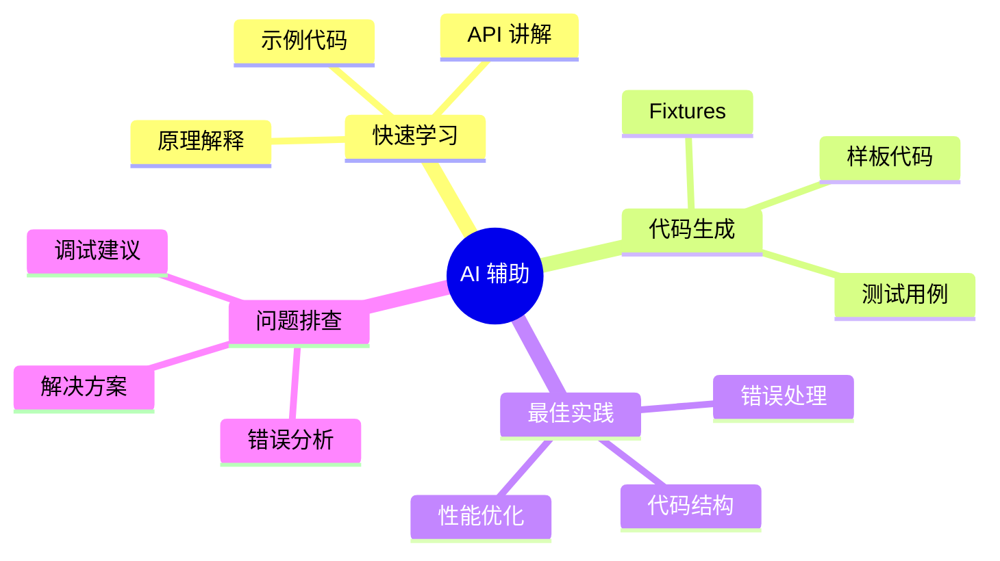

---

## 第二部分：AI 辅助学习 Playwright

### 2.1 从零开始：搭建测试环境

#### 实践对话 1：初始化项目

```
💬 你: 帮我初始化一个 Playwright 项目，支持移动端测试

🤖 AI: 我来帮你搭建：

1. 安装依赖
   pnpm install -D @playwright/test

2. 创建配置文件 playwright.config.ts
   - 配置移动设备模拟
   - 设置中文语言和时区
   - 配置报告输出

3. 创建测试目录结构
   tests/
   ├── fixtures/      # 自定义 fixtures
   ├── tbox/          # 业务测试
   └── helpers/       # 工具函数
```

#### 项目配置示例

```typescript
// playwright.config.ts
import { defineConfig, devices } from "@playwright/test";

export default defineConfig({
  testDir: "./tests",
  timeout: 30 * 1000,

  use: {
    baseURL: process.env.BASE_URL || "https://m.alipay.com",
    locale: "zh-CN",
    timezoneId: "Asia/Shanghai",
    trace: "on-first-retry",
    screenshot: "only-on-failure",
    video: "retain-on-failure",
  },

  projects: [
    {
      name: "Mobile Chrome",
      use: {
        ...devices["Pixel 5"],
        viewport: { width: 375, height: 667 },
      },
    },
  ],
});
```

### 2.2 理解核心概念

#### Playwright 核心概念图

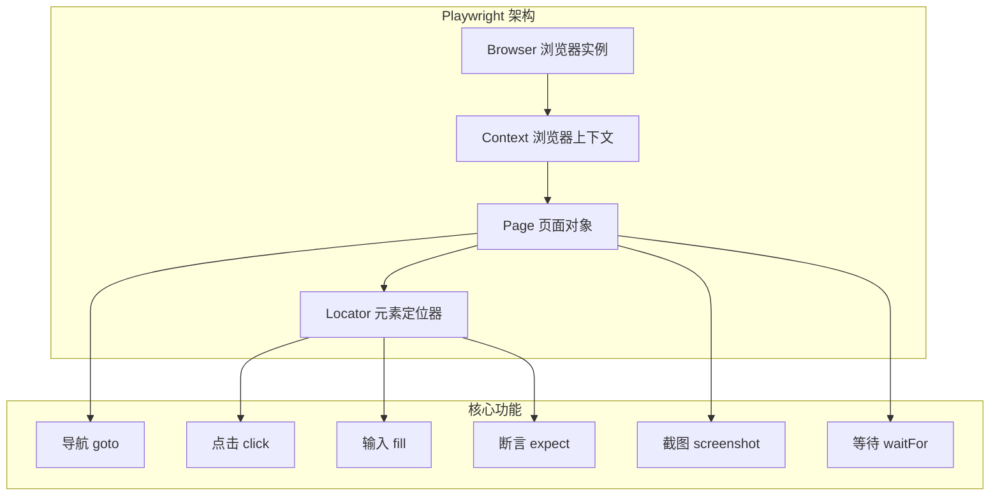

#### 实践对话 2：编写第一个测试

```
💬 你: 帮我写一个测试，访问页面并截图

🤖 AI:
```

```typescript
import { test, expect } from "@playwright/test";

test("访问页面并截图", async ({ page }) => {
  // 1. 访问页面
  await page.goto("https://example.com");

  // 2. 等待页面加载
  await page.waitForLoadState("domcontentloaded");

  // 3. 等待网络空闲（可选，有些页面可能不会完全空闲）
  await page.waitForLoadState("networkidle", { timeout: 10000 })
    .catch(() => console.log("网络未完全空闲，继续执行"));

  // 4. 截图对比
  await expect(page).toHaveScreenshot("homepage.png", {
    fullPage: true,
    maxDiffPixelRatio: 0.02,
  });
});
```

### 2.3 深入学习：自定义 Fixtures

#### Fixture 工作原理

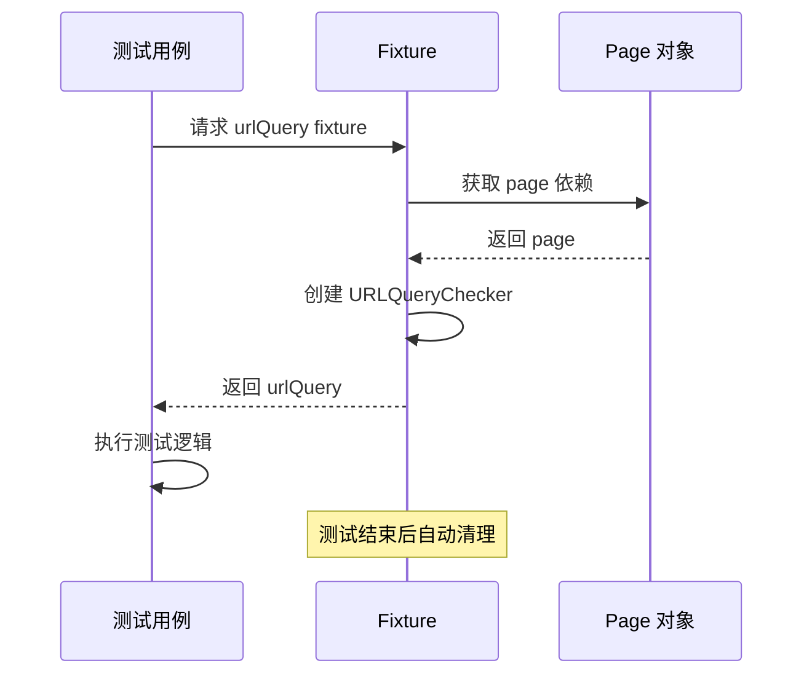

#### 项目中的 Fixtures 设计

```typescript
// tests/fixtures/index.ts
import { test as base } from "@playwright/test";
import { URLQueryChecker } from "./helpers/url-query-checker";
import { ApiMonitor } from "./helpers/api-monitor";

type CustomFixtures = {
  urlQuery: URLQueryChecker;      // URL 参数验证
  apiMonitor: ApiMonitor;         // API 响应监控
  performance: PerformanceMonitor; // 性能监控
  websocket: WebSocketMonitor;     // WebSocket 监控
  platformContext: PlatformContext; // 多平台支持
  myAgent: MyAgent;                // 智能体交互
};

export const test = base.extend<CustomFixtures>({
  urlQuery: async ({ page }, use) => {
    const checker = new URLQueryChecker(page);
    await use(checker);
  },

  apiMonitor: async ({ page }, use) => {
    const monitor = new ApiMonitor(page);
    await use(monitor);
    await monitor.stop(); // 自动清理
  },
  // ...其他 fixtures
});
```

#### 实践对话 3：学习 Fixture

```
💬 你: Playwright fixture 是什么？如何创建自定义 fixture？

🤖 AI: Fixture 是 Playwright 的依赖注入机制，用于：
1. 在测试间共享设置逻辑
2. 自动管理资源生命周期
3. 提供类型安全的测试辅助工具

创建步骤：
1. 定义类型接口
2. 使用 base.extend() 扩展
3. 在 fixture 函数中创建实例
4. 通过 use() 传递给测试
5. use() 之后的代码是清理逻辑
```

---

## 第三部分：Skill 系统化测试开发

### 3.1 什么是 Skill？

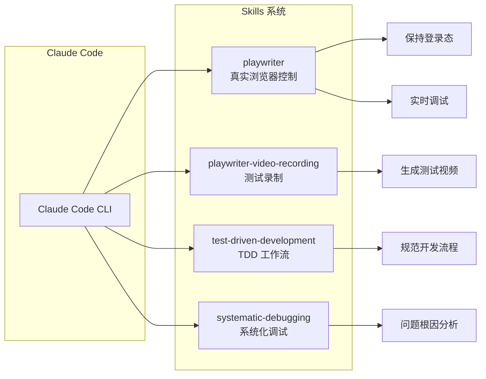

### 3.2 Playwriter Skill 实战

#### Playwriter 工作原理

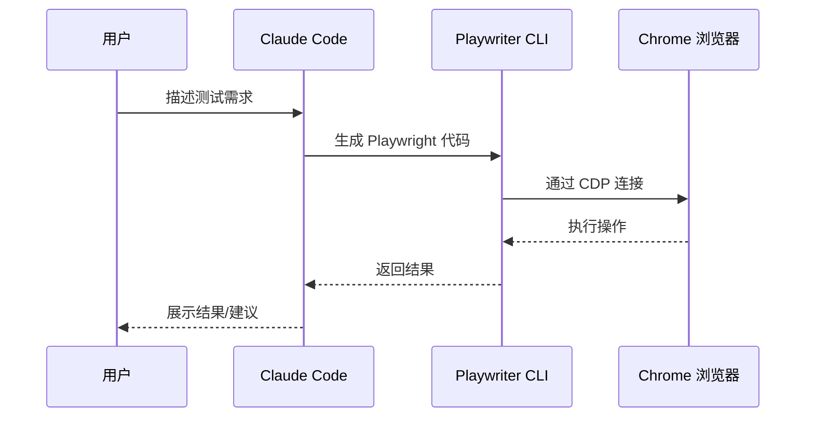

#### 场景 1：真实浏览器调试

```bash
# 1. 创建新的浏览器会话
playwriter session new

# 2. 连接到会话并执行操作
playwriter -s 1 -e "await page.goto('https://example.com')"

# 3. 获取页面信息
playwriter -s 1 -e "console.log(await page.title())"

# 4. 截图
playwriter -s 1 -e "await page.screenshot({ path: './screenshot.png' })"
```

#### 场景 2：保持登录态测试

```
💬 你: 某些页面需要手动登录，如何测试？

🤖 AI: 使用 playwriter 的真实浏览器模式：

1. 启动会话：playwriter session new
2. 手动在浏览器中完成登录
3. 执行自动化测试（会话保持登录态）
4. 测试完成后关闭会话
```

### 3.3 视频录制 Skill

#### 录制流程

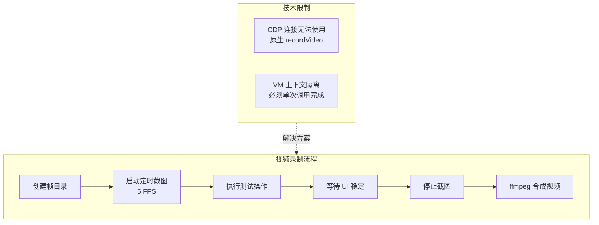

#### 录制代码示例

```javascript
// 单次调用完成录制
const fs = require('fs');
const path = require('path');

// 1. 创建帧目录
const videoDir = './videos';
const timestamp = Date.now();
const framesDir = path.join(videoDir, 'frames_' + timestamp);
fs.mkdirSync(framesDir, { recursive: true });

// 2. 开始定时截图 (5 FPS)
let frameIndex = 0;
let recording = true;
const captureFrame = async () => {
  if (!recording) return;
  try {
    const screenshotPath = path.join(framesDir,
      'frame_' + String(frameIndex++).padStart(5, '0') + '.png');
    await page.screenshot({ path: screenshotPath });
  } catch (e) {}
  if (recording) setTimeout(captureFrame, 200);
};
captureFrame();

// 3. 执行测试操作
await page.locator('text=按钮').click();

// 4. 等待 UI 稳定
await page.waitForTimeout(3000);

// 5. 停止录制
recording = false;
console.log('录制完成，共', frameIndex, '帧');
```

```bash
# 合成视频
ffmpeg -y -framerate 5 \
  -i ./videos/frames_*/frame_%05d.png \
  -c:v libx264 -pix_fmt yuv420p \
  ./videos/recording.mp4
```

### 3.4 TDD Skill 工作流

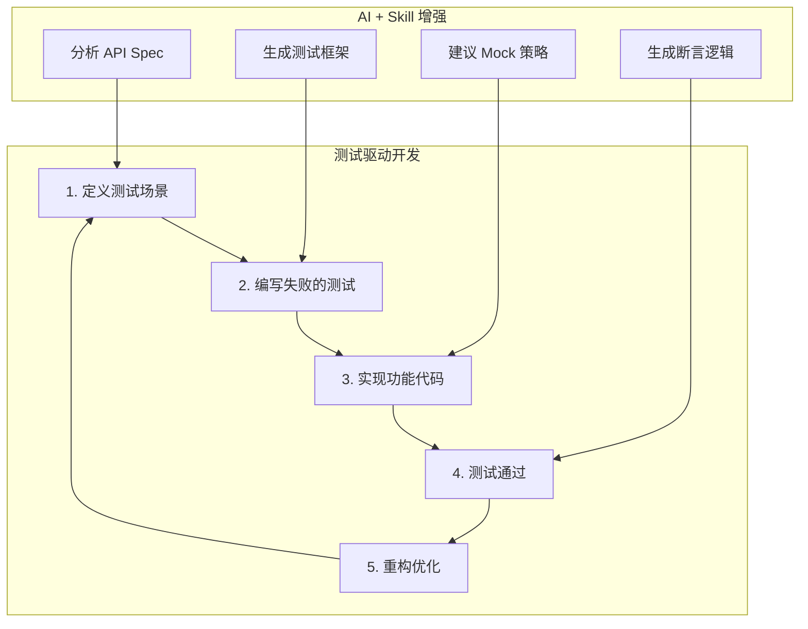

---

## 第四部分：完整测试开发流程演示

### 4.1 案例：为新功能编写测试

#### 需求拆解

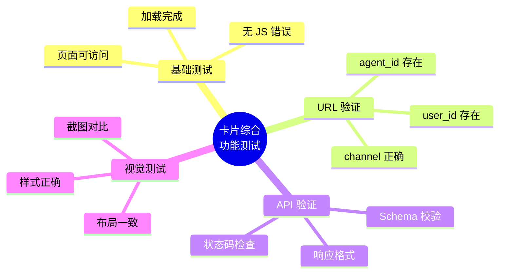

#### 步骤 1：需求分析

```
💬 你: 我要测试卡片综合功能，包括页面加载、URL 参数、API 调用

🤖 AI: 让我帮你拆解任务：

1. 基础可访问性测试
   - 页面能正常打开
   - 加载状态正确
   - 无控制台错误

2. URL 参数验证测试
   - 验证必需参数存在
   - 验证参数值正确

3. API 响应验证测试
   - 监控关键 API 调用
   - 验证响应格式
   - Schema 校验

4. 视觉回归测试
   - 截图基准对比
   - 允许合理差异
```

#### 步骤 2：编写测试代码

```typescript
// tests/tbox/basic.spec.ts
import * as fs from "fs";
import * as path from "path";
import { test, expect, waitForUIStableWithLog } from "../fixtures";
import { DomainsFile } from "./type";

// 读取配置
const domainConfigPath = path.join(__dirname, "domain.json");
const domainsData: DomainsFile = JSON.parse(
  fs.readFileSync(domainConfigPath, "utf-8"),
);

const domains = [
  domainsData.domains.find((d) => d.name === "卡片综合")
].filter((d): d is NonNullable<typeof d> => Boolean(d));

test.describe("智能体基础可访问性测试", () => {
  domains.forEach((domain) => {

    // 测试 1：访问并截图
    test(`${domain.name} - 访问并截图`, async ({ page }) => {
      await page.goto(domain.url);
      await page.waitForLoadState("domcontentloaded");

      // 等待网络空闲
      await page.waitForLoadState("networkidle", { timeout: 30000 })
        .catch(() => console.log("网络未完全空闲，继续执行"));

      // 等待 UI 稳定
      await waitForUIStableWithLog(page, {
        logPrefix: "\n[waitForUIStable]",
        maxWaitTime: 3000,
      });

      // 截图对比
      await expect(page).toHaveScreenshot(`${domain.name}-initial.png`, {
        fullPage: true,
        maxDiffPixelRatio: 0.02,
        animations: "disabled",
      });
    });

    // 测试 2：URL 参数验证
    test(`${domain.name} - URL 参数验证`, async ({ urlQuery, page }) => {
      await page.goto(domain.url);

      // 验证必需参数
      await urlQuery.expectParamExists("agent_id");
      await urlQuery.expectParamExists("user_id");
      await urlQuery.expectParamExists("channel");
      await urlQuery.expectParamExists("code");

      // 验证参数值
      const userId = await urlQuery.getParam("user_id");
      await urlQuery.expectParamEquals("channel", "tbox_nologin");
      await urlQuery.expectParamEquals("code", userId!);

      console.log(`✅ ${domain.name} 域的 URL 参数验证通过`);
    });
  });
});
```

#### 步骤 3：调试优化

```
💬 你: 测试偶尔超时，如何优化？

🤖 AI: 分析可能原因并给出建议：

1. 调整等待策略
   - waitForLoadState 使用 domcontentloaded 而非 load
   - networkidle 添加 catch 容错

2. 自定义 UI 稳定检测
   - 使用 MutationObserver 监听 DOM 变化
   - 设置合理的稳定时间阈值

3. 增加容错处理
   - 关键操作添加 retry
   - 非关键等待添加 catch
```

### 4.2 数据驱动测试架构

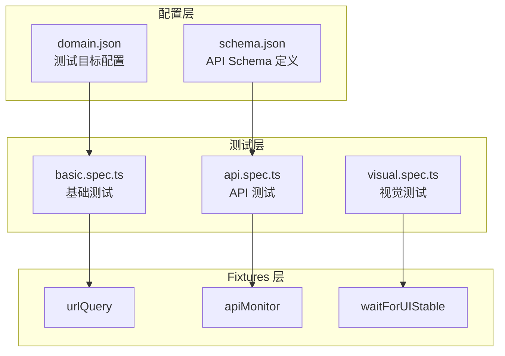

---

## 第五部分：最佳实践与经验总结

### 5.1 AI 辅助开发的最佳实践

#### DO's ✅

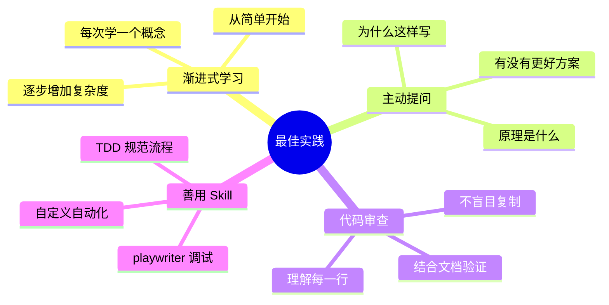

#### DON'Ts ❌

| 错误做法 | 问题 | 正确做法 |
|---------|------|---------|
| 过度依赖 AI | 不理解原理，难以调试 | 理解后再使用 |
| 直接复制粘贴 | 代码不适合项目 | 根据需求调整 |
| 忽略官方文档 | 错过重要细节 | AI + 文档结合 |
| 不写注释 | 后期难以维护 | 关键逻辑加注释 |

### 5.2 项目亮点设计

#### 模块化 Fixtures 架构

```typescript
// 统一导出，使用方便
export { test, expect } from './base'
export { urlQuery } from './url-query'
export { apiMonitor } from './api-monitor'
export { waitForUIStable } from './wait-utils'

// 使用示例
import { test, expect, urlQuery, apiMonitor } from '../fixtures';

test('完整测试', async ({ page, urlQuery, apiMonitor }) => {
  // 直接使用注入的 fixtures
});
```

#### 配置驱动测试

```json
// domain.json
{
  "domains": [
    {
      "name": "卡片综合",
      "url": "https://...",
      "expectedParams": ["agent_id", "user_id"]
    },
    {
      "name": "文旅",
      "url": "https://...",
      "expectedParams": ["agent_id", "scene"]
    }
  ]
}
```

#### Schema 验证

```typescript
import { z } from 'zod';

// 定义 API 响应 Schema
const TboxAuthResponseSchema = z.object({
  hostName: z.string(),
  result: z.string(),
  success: z.boolean(),
  data: z.object({
    token: z.string().optional(),
    expireTime: z.number().optional(),
  }).optional(),
});

// 测试中使用
test('API 响应验证', async ({ apiMonitor, page }) => {
  const response = await apiMonitor.waitForResponse('/api/auth');
  const result = TboxAuthResponseSchema.safeParse(response);
  expect(result.success).toBe(true);
});
```

### 5.3 测试金字塔

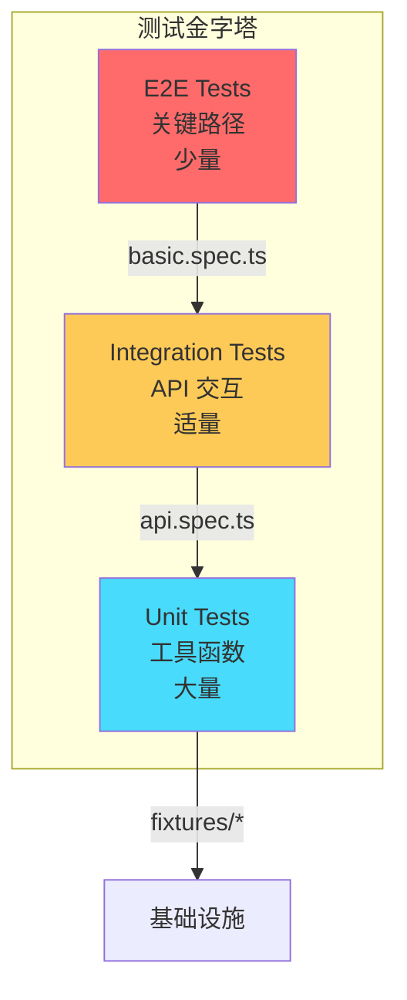

---

## 第六部分：未来展望

### 6.1 AI + 测试的未来

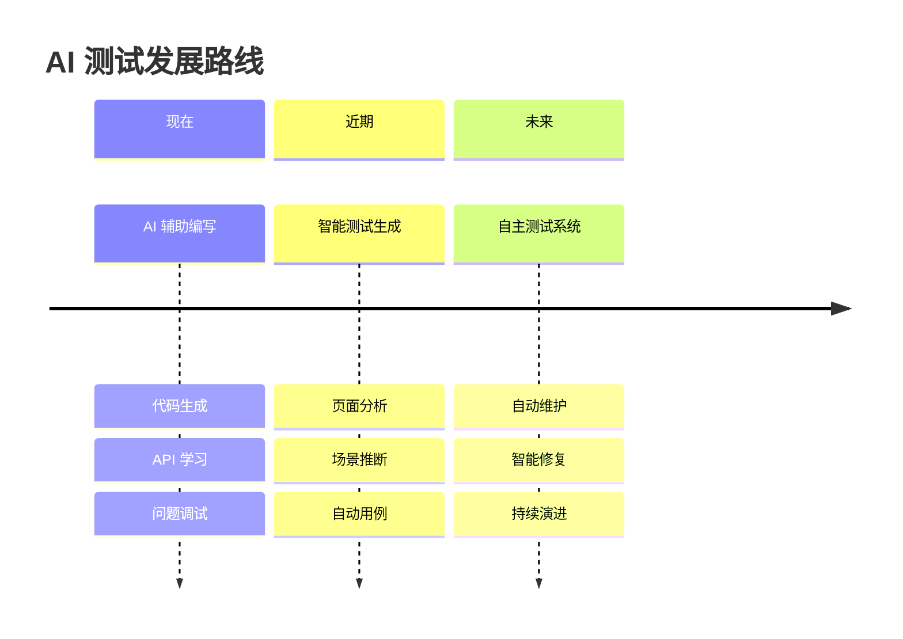

### 6.2 项目下一步计划

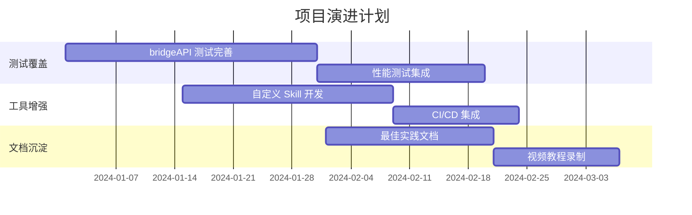

### 6.3 推荐资源

| 资源 | 链接 | 用途 |
|------|------|------|
| Playwright 官方文档 | playwright.dev | API 参考 |
| Claude Code | claude.com/claude-code | AI 辅助工具 |
| Playwriter | npm: playwriter | 浏览器控制 |
| Testing Library | testing-library.com | 测试理念 |

---

## 附录

### A. 演示准备清单

- [ ] 确保 `pnpm install` 完成
- [ ] 准备 `playwriter session new` 演示
- [ ] 准备 AI 对话截图
- [ ] 测试运行通过：`pnpm test`

### B. 常用命令

```bash
# 运行所有测试
pnpm test

# 运行特定测试
pnpm test tests/tbox/basic.spec.ts

# UI 模式（带可视化界面）
pnpm test --ui

# 生成测试报告
pnpm test --reporter=html

# Playwriter 会话管理
playwriter session new
playwriter session list
playwriter -s 1 -e "await page.goto('...')"
```

### C. 问题排查

| 问题 | 可能原因 | 解决方案 |
|------|---------|---------|
| 测试超时 | 网络慢/等待策略不当 | 调整 timeout、使用 catch |
| 选择器失败 | 元素未加载/选择器错误 | 添加等待、检查选择器 |
| 截图差异 | 动态内容/动画 | 禁用动画、等待稳定 |
| API 验证失败 | Schema 变更 | 更新 Schema 定义 |

---

> 📝 本文档基于实际项目经验编写，持续更新中。
>
> 🤖 AI 辅助开发不是替代开发者，而是让开发者更高效。
