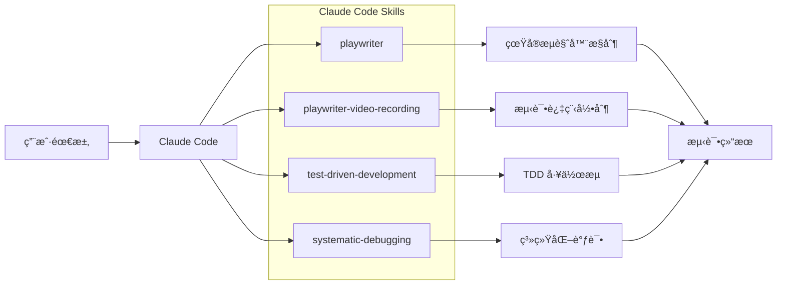
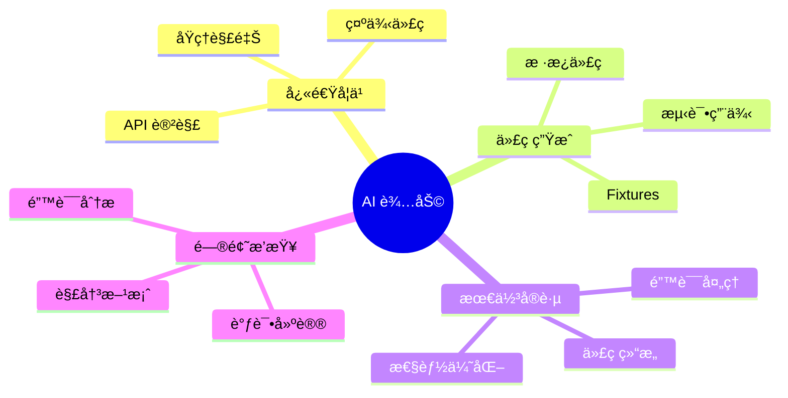
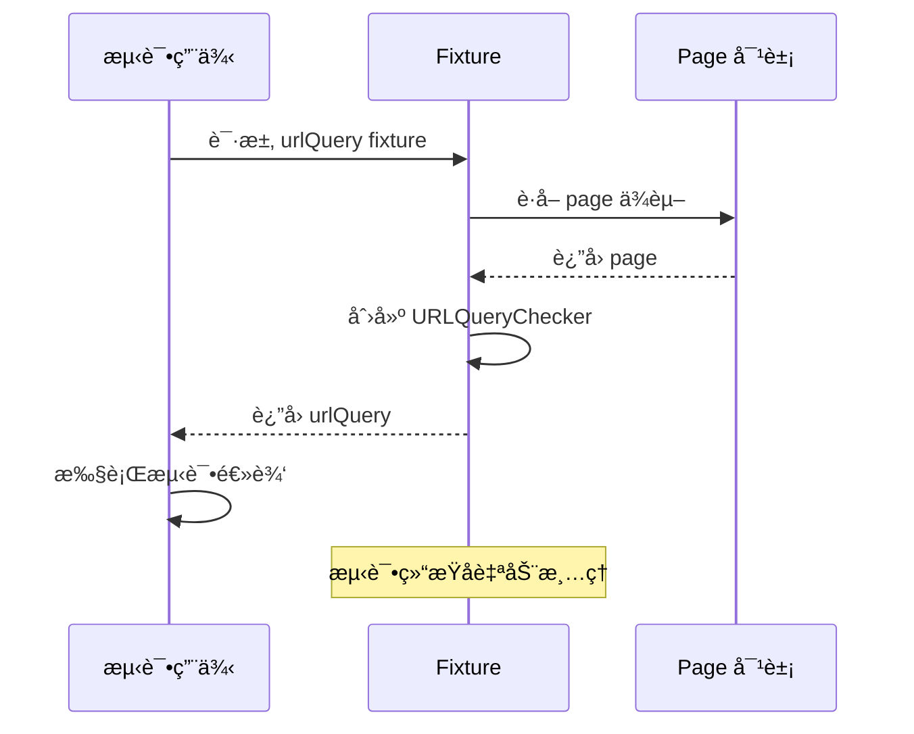
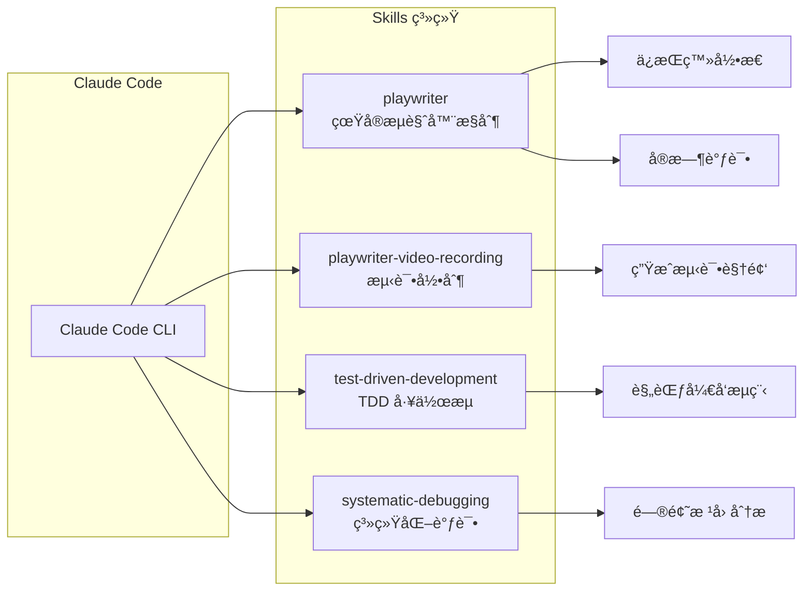
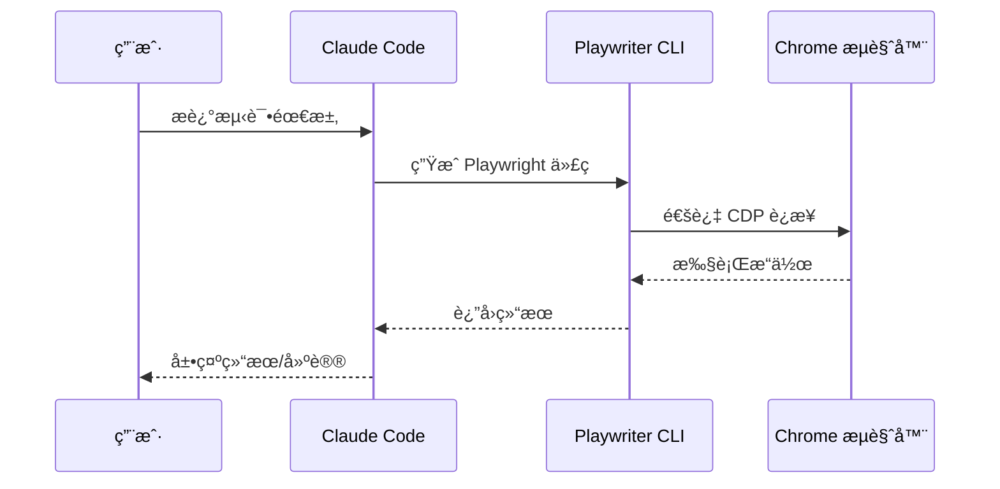
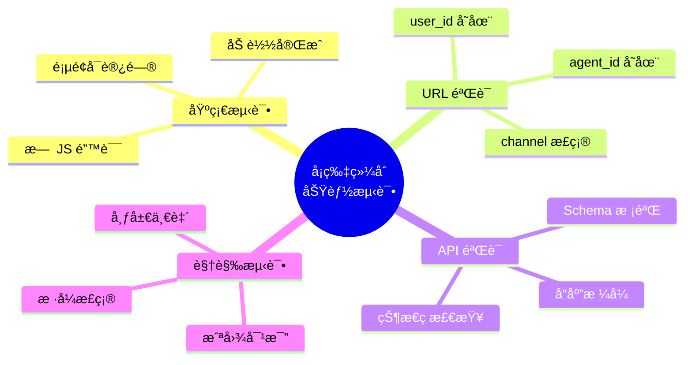
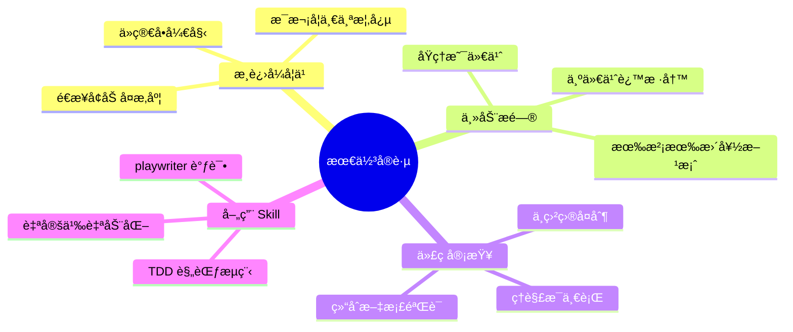
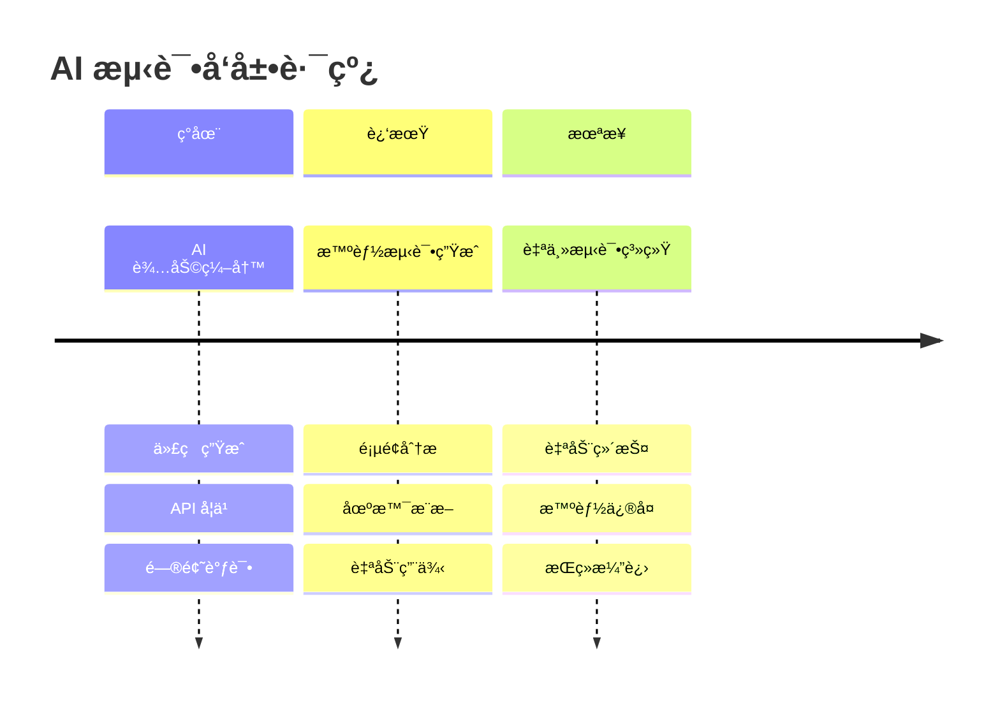
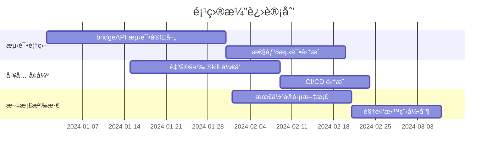

# AI 辅助 e2e 测试编写å®æˆ˜

> åŸºäº Claude Code Skills å’Œ Playwright 的测试开å‘最佳å®è·µ

---

## 目录

1. [项目背景ä¸æµ‹è¯•æŒ‘战](#第一部分项目背景ä¸æµ‹è¯•æŒ‘战)
2. [AI 辅助学习 Playwright](#第二部分ai-辅助学习-playwright)
3. [Skill 系统化测试开å‘](#第三部分skill-系统化测试开å‘)
4. [完整测试开å‘æµç¨‹æ¼”示](#第四部分完整测试开å‘æµç¨‹æ¼”示)
5. [最佳å®è·µä¸ç»éªŒæ€»ç»“](#第五部分最佳å®è·µä¸ç»éªŒæ€»ç»“)
6. [未æ¥å±•æœ›](#第六部分未æ¥å±•æœ›)

---

## 核心æµç¨‹å›¾

### AI 辅助测试开å‘整体æµç¨‹

```mermaid
flowchart TB
    subgraph 传统方å¼["⌠传统测试开å‘"]
        T1[阅读文档] --> T2[编写代ç ]
        T2 --> T3[调试问题]
        T3 --> T4[æœç´¢è§£å†³æ–¹æ¡ˆ]
        T4 --> T2
    end

    subgraph AIæ–¹å¼["✅ AI 辅助测试开å‘"]
        A1[æ述需求] --> A2[AI 生æˆä»£ç ]
        A2 --> A3[AI 解释åŸç†]
        A3 --> A4[è¿è¡ŒéªŒè¯]
        A4 --> A5{通过?}
        A5 -->|å¦| A6[AI 辅助调试]
        A6 --> A2
        A5 -->|是| A7[完æˆ]
    end

    ä¼ ç»Ÿæ–¹å¼ -.->|效ç‡æå‡| AIæ–¹å¼
```

### Skill 工作æµç¨‹



### 测试开å‘周期

```mermaid
flowchart TB
    subgraph 需求分æ["1ï¸âƒ£ 需求分æ"]
        R1[ç†è§£æµ‹è¯•ç›®æ ‡]
        R2[拆解测试场景]
        R3[确定验è¯ç‚¹]
    end

    subgraph 学习阶段["2ï¸âƒ£ AI 辅助学习"]
        L1[学习相关 API]
        L2[ç†è§£æœ€ä½³å®è·µ]
        L3[è·å–代ç ç¤ºä¾‹]
    end

    subgraph å¼€å‘阶段["3ï¸âƒ£ 编写测试"]
        D1[创建测试结æ„]
        D2[å®ç°æµ‹è¯•é€»è¾‘]
        D3[添加断言]
    end

    subgraph 调试阶段["4ï¸âƒ£ 调试优化"]
        T1[è¿è¡Œæµ‹è¯•]
        T2[分æ失败]
        T3[优化代ç ]
    end

    需求分æ --> 学习阶段
    学习阶段 --> å¼€å‘阶段
    å¼€å‘阶段 --> 调试阶段
    调试阶段 -->|迭代| å¼€å‘阶段
```

---

## 第一部分：项目背景ä¸æµ‹è¯•æŒ‘战

### 1.1 项目介ç»

本项目是一个**智能体检测平å°ï¼ˆTBox）**çš„ e2e 测试框æ¶ï¼Œå…·æœ‰ä»¥ä¸‹ç‰¹ç‚¹ï¼š

- 多平å°æ”¯æŒï¼ˆæ”¯ä»˜å® H5ã€åŸç”Ÿç¯å¢ƒï¼‰
- å¤æ‚çš„ bridgeAPI 交互
- 需è¦éªŒè¯ URL å‚æ•°ã€API å“应ã€UI 渲染

```mermaid
graph TB
    subgraph 测试目标["测试目标"]
        P1[æ”¯ä»˜å® H5]
        P2[微信å°ç¨‹åº]
        P3[åŸç”Ÿ WebView]
    end

    subgraph 验è¯å†…容["验è¯å†…容"]
        V1[页é¢å¯è®¿é—®æ€§]
        V2[URL å‚数正确性]
        V3[API å“应格å¼]
        V4[UI 视觉一致性]
    end

    P1 --> V1
    P1 --> V2
    P2 --> V3
    P3 --> V4
```

### 1.2 传统测试开å‘的痛点

| 痛点 | æè¿° | å½±å“ |
|------|------|------|
| 学习曲线陡峭 | Playwright API 众多，难以快速上手 | å¼€å‘效ç‡ä½ |
| 编写ç¹ç | 选择器ã€æ–­è¨€ã€ç­‰å¾…逻辑é‡å¤ | 代ç å†—ä½™ |
| 缺ä¹æœ€ä½³å®è·µ | ä¸çŸ¥é“å¦‚ä½•ç»„ç»‡æµ‹è¯•ç»“æ„ | 维护困难 |
| 调试困难 | 问题难以定ä½å’Œå¤ç° | æ’查耗时 |

### 1.3 引入 AI 辅助的动机



---

## 第二部分：AI 辅助学习 Playwright

### 2.1 ä»é›¶å¼€å§‹ï¼šæ­å»ºæµ‹è¯•ç¯å¢ƒ

#### å®è·µå¯¹è¯ 1：åˆå§‹åŒ–项目

```
💬 ä½ : 帮我åˆå§‹åŒ–一个 Playwright 项目，支æŒç§»åŠ¨ç«¯æµ‹è¯•

🤖 AI: 我æ¥å¸®ä½ æ­å»ºï¼š

1. 安装ä¾èµ–
   pnpm install -D @playwright/test

2. 创建é…置文件 playwright.config.ts
   - é…置移动设备模拟
   - 设置中文语言和时区
   - é…置报告输出

3. 创建测试目录结æ„
   tests/
   ├── fixtures/      # 自定义 fixtures
   ├── tbox/          # 业务测试
   └── helpers/       # 工具函数
```

#### 项目é…置示例

```typescript
// playwright.config.ts
import { defineConfig, devices } from "@playwright/test";

export default defineConfig({
  testDir: "./tests",
  timeout: 30 * 1000,

  use: {
    baseURL: process.env.BASE_URL || "https://m.alipay.com",
    locale: "zh-CN",
    timezoneId: "Asia/Shanghai",
    trace: "on-first-retry",
    screenshot: "only-on-failure",
    video: "retain-on-failure",
  },

  projects: [
    {
      name: "Mobile Chrome",
      use: {
        ...devices["Pixel 5"],
        viewport: { width: 375, height: 667 },
      },
    },
  ],
});
```

### 2.2 ç†è§£æ ¸å¿ƒæ¦‚念

#### Playwright 核心概念图

```mermaid
graph TB
    subgraph Playwright["Playwright æ¶æ„"]
        Browser[Browser æµè§ˆå™¨å®ä¾‹]
        Context[Context æµè§ˆå™¨ä¸Šä¸‹æ–‡]
        Page[Page 页é¢å¯¹è±¡]
        Locator[Locator 元素定ä½å™¨]
    end

    Browser --> Context
    Context --> Page
    Page --> Locator

    subgraph 功能["核心功能"]
        F1[导航 goto]
        F2[点击 click]
        F3[输入 fill]
        F4[断言 expect]
        F5[截图 screenshot]
        F6[等待 waitFor]
    end

    Page --> F1
    Page --> F5
    Locator --> F2
    Locator --> F3
    Locator --> F4
    Page --> F6
```

#### å®è·µå¯¹è¯ 2：编写第一个测试

```
💬 ä½ : 帮我写一个测试，访问页é¢å¹¶æˆªå›¾

🤖 AI:
```

```typescript
import { test, expect } from "@playwright/test";

test("访问页é¢å¹¶æˆªå›¾", async ({ page }) => {
  // 1. 访问页é¢
  await page.goto("https://example.com");

  // 2. 等待页é¢åŠ è½½
  await page.waitForLoadState("domcontentloaded");

  // 3. 等待网络空闲（å¯é€‰ï¼Œæœ‰äº›é¡µé¢å¯èƒ½ä¸ä¼šå®Œå…¨ç©ºé—²ï¼‰
  await page.waitForLoadState("networkidle", { timeout: 10000 })
    .catch(() => console.log("网络未完全空闲，继续执行"));

  // 4. 截图对比
  await expect(page).toHaveScreenshot("homepage.png", {
    fullPage: true,
    maxDiffPixelRatio: 0.02,
  });
});
```

### 2.3 深入学习：自定义 Fixtures

#### Fixture 工作åŸç†



#### 项目中的 Fixtures 设计

```typescript
// tests/fixtures/index.ts
import { test as base } from "@playwright/test";
import { URLQueryChecker } from "./helpers/url-query-checker";
import { ApiMonitor } from "./helpers/api-monitor";

type CustomFixtures = {
  urlQuery: URLQueryChecker;      // URL å‚数验è¯
  apiMonitor: ApiMonitor;         // API å“应监æ§
  performance: PerformanceMonitor; // 性能监æ§
  websocket: WebSocketMonitor;     // WebSocket 监æ§
  platformContext: PlatformContext; // 多平å°æ”¯æŒ
  myAgent: MyAgent;                // 智能体交互
};

export const test = base.extend<CustomFixtures>({
  urlQuery: async ({ page }, use) => {
    const checker = new URLQueryChecker(page);
    await use(checker);
  },

  apiMonitor: async ({ page }, use) => {
    const monitor = new ApiMonitor(page);
    await use(monitor);
    await monitor.stop(); // 自动清ç†
  },
  // ...其他 fixtures
});
```

#### å®è·µå¯¹è¯ 3：学习 Fixture

```
💬 你: Playwright fixture 是什么？如何创建自定义 fixture？

🤖 AI: Fixture 是 Playwright çš„ä¾èµ–注入机制，用äºï¼š
1. 在测试间共享设置逻辑
2. 自动管ç†èµ„æºç”Ÿå‘½å‘¨æœŸ
3. æ供类å‹å®‰å…¨çš„测试辅助工具

创建步骤：
1. 定义类å‹æ¥å£
2. 使用 base.extend() 扩展
3. 在 fixture 函数中创建å®ä¾‹
4. 通过 use() 传递给测试
5. use() 之å的代ç æ˜¯æ¸…ç†é€»è¾‘
```

---

## 第三部分：Skill 系统化测试开å‘

### 3.1 什么是 Skill？



### 3.2 Playwriter Skill å®æˆ˜

#### Playwriter 工作åŸç†



#### 场景 1：真å®æµè§ˆå™¨è°ƒè¯•

```bash
# 1. 创建新的æµè§ˆå™¨ä¼šè¯
playwriter session new

# 2. è¿æ¥åˆ°ä¼šè¯å¹¶æ‰§è¡Œæ“作
playwriter -s 1 -e "await page.goto('https://example.com')"

# 3. è·å–页é¢ä¿¡æ¯
playwriter -s 1 -e "console.log(await page.title())"

# 4. 截图
playwriter -s 1 -e "await page.screenshot({ path: './screenshot.png' })"
```

#### 场景 2：ä¿æŒç™»å½•æ€æµ‹è¯•

```
💬 ä½ : æŸäº›é¡µé¢éœ€è¦æ‰‹åŠ¨ç™»å½•ï¼Œå¦‚何测试？

🤖 AI: 使用 playwriter 的真å®æµè§ˆå™¨æ¨¡å¼ï¼š

1. å¯åŠ¨ä¼šè¯ï¼šplaywriter session new
2. 手动在æµè§ˆå™¨ä¸­å®Œæˆç™»å½•
3. 执行自动化测试（会è¯ä¿æŒç™»å½•æ€ï¼‰
4. 测试完æˆå关闭会è¯
```

### 3.3 视频录制 Skill

#### 录制æµç¨‹

```mermaid
flowchart TB
    subgraph 录制过程["视频录制æµç¨‹"]
        A[创建帧目录] --> B[å¯åŠ¨å®šæ—¶æˆªå›¾<br/>5 FPS]
        B --> C[执行测试æ“作]
        C --> D[等待 UI 稳定]
        D --> E[åœæ­¢æˆªå›¾]
        E --> F[ffmpeg åˆæˆè§†é¢‘]
    end

    subgraph é™åˆ¶["技术é™åˆ¶"]
        L1[CDP è¿æ¥æ— æ³•ä½¿ç”¨<br/>åŸç”Ÿ recordVideo]
        L2[VM 上下文隔离<br/>å¿…é¡»å•æ¬¡è°ƒç”¨å®Œæˆ]
    end

    é™åˆ¶ -.->|解决方案| 录制过程
```

#### 录制代ç ç¤ºä¾‹

```javascript
// å•æ¬¡è°ƒç”¨å®Œæˆå½•åˆ¶
const fs = require('fs');
const path = require('path');

// 1. 创建帧目录
const videoDir = './videos';
const timestamp = Date.now();
const framesDir = path.join(videoDir, 'frames_' + timestamp);
fs.mkdirSync(framesDir, { recursive: true });

// 2. 开始定时截图 (5 FPS)
let frameIndex = 0;
let recording = true;
const captureFrame = async () => {
  if (!recording) return;
  try {
    const screenshotPath = path.join(framesDir,
      'frame_' + String(frameIndex++).padStart(5, '0') + '.png');
    await page.screenshot({ path: screenshotPath });
  } catch (e) {}
  if (recording) setTimeout(captureFrame, 200);
};
captureFrame();

// 3. 执行测试æ“作
await page.locator('text=按钮').click();

// 4. 等待 UI 稳定
await page.waitForTimeout(3000);

// 5. åœæ­¢å½•åˆ¶
recording = false;
console.log('录制完æˆï¼Œå…±', frameIndex, '帧');
```

```bash
# åˆæˆè§†é¢‘
ffmpeg -y -framerate 5 \
  -i ./videos/frames_*/frame_%05d.png \
  -c:v libx264 -pix_fmt yuv420p \
  ./videos/recording.mp4
```

### 3.4 TDD Skill 工作æµ

```mermaid
flowchart TB
    subgraph TDD["测试驱动开å‘"]
        T1[1. 定义测试场景] --> T2[2. 编写失败的测试]
        T2 --> T3[3. å®ç°åŠŸèƒ½ä»£ç ]
        T3 --> T4[4. 测试通过]
        T4 --> T5[5. é‡æ„优化]
        T5 --> T1
    end

    subgraph AIå¢å¼º["AI + Skill å¢å¼º"]
        A1[分æ API Spec]
        A2[生æˆæµ‹è¯•æ¡†æ¶]
        A3[建议 Mock 策略]
        A4[生æˆæ–­è¨€é€»è¾‘]
    end

    A1 --> T1
    A2 --> T2
    A3 --> T3
    A4 --> T4
```

---

## 第四部分：完整测试开å‘æµç¨‹æ¼”示

### 4.1 案例：为新功能编写测试

#### 需求拆解



#### 步骤 1：需求分æ

```
💬 ä½ : 我è¦æµ‹è¯•å¡ç‰‡ç»¼åˆåŠŸèƒ½ï¼ŒåŒ…括页é¢åŠ è½½ã€URL å‚æ•°ã€API 调用

🤖 AI: 让我帮你拆解任务：

1. 基础å¯è®¿é—®æ€§æµ‹è¯•
   - 页é¢èƒ½æ­£å¸¸æ‰“å¼€
   - 加载状æ€æ­£ç¡®
   - æ— æ§åˆ¶å°é”™è¯¯

2. URL å‚数验è¯æµ‹è¯•
   - 验è¯å¿…需å‚数存在
   - 验è¯å‚数值正确

3. API å“应验è¯æµ‹è¯•
   - 监æ§å…³é”® API 调用
   - 验è¯å“应格å¼
   - Schema 校验

4. 视觉å›å½’测试
   - 截图基准对比
   - å…许åˆç†å·®å¼‚
```

#### 步骤 2：编写测试代ç 

```typescript
// tests/tbox/basic.spec.ts
import * as fs from "fs";
import * as path from "path";
import { test, expect, waitForUIStableWithLog } from "../fixtures";
import { DomainsFile } from "./type";

// 读å–é…ç½®
const domainConfigPath = path.join(__dirname, "domain.json");
const domainsData: DomainsFile = JSON.parse(
  fs.readFileSync(domainConfigPath, "utf-8"),
);

const domains = [
  domainsData.domains.find((d) => d.name === "å¡ç‰‡ç»¼åˆ")
].filter((d): d is NonNullable<typeof d> => Boolean(d));

test.describe("智能体基础å¯è®¿é—®æ€§æµ‹è¯•", () => {
  domains.forEach((domain) => {

    // 测试 1：访问并截图
    test(`${domain.name} - 访问并截图`, async ({ page }) => {
      await page.goto(domain.url);
      await page.waitForLoadState("domcontentloaded");

      // 等待网络空闲
      await page.waitForLoadState("networkidle", { timeout: 30000 })
        .catch(() => console.log("网络未完全空闲，继续执行"));

      // 等待 UI 稳定
      await waitForUIStableWithLog(page, {
        logPrefix: "\n[waitForUIStable]",
        maxWaitTime: 3000,
      });

      // 截图对比
      await expect(page).toHaveScreenshot(`${domain.name}-initial.png`, {
        fullPage: true,
        maxDiffPixelRatio: 0.02,
        animations: "disabled",
      });
    });

    // 测试 2：URL å‚数验è¯
    test(`${domain.name} - URL å‚数验è¯`, async ({ urlQuery, page }) => {
      await page.goto(domain.url);

      // 验è¯å¿…需å‚æ•°
      await urlQuery.expectParamExists("agent_id");
      await urlQuery.expectParamExists("user_id");
      await urlQuery.expectParamExists("channel");
      await urlQuery.expectParamExists("code");

      // 验è¯å‚数值
      const userId = await urlQuery.getParam("user_id");
      await urlQuery.expectParamEquals("channel", "tbox_nologin");
      await urlQuery.expectParamEquals("code", userId!);

      console.log(`✅ ${domain.name} 域的 URL å‚数验è¯é€šè¿‡`);
    });
  });
});
```

#### 步骤 3：调试优化

```
💬 ä½ : 测试å¶å°”超时，如何优化？

🤖 AI: 分æå¯èƒ½åŸå› å¹¶ç»™å‡ºå»ºè®®ï¼š

1. 调整等待策略
   - waitForLoadState 使用 domcontentloaded 而é load
   - networkidle 添加 catch 容错

2. 自定义 UI 稳定检测
   - 使用 MutationObserver ç›‘å¬ DOM å˜åŒ–
   - 设置åˆç†çš„稳定时间阈值

3. å¢åŠ å®¹é”™å¤„ç†
   - 关键æ“作添加 retry
   - é关键等待添加 catch
```

### 4.2 æ•°æ®é©±åŠ¨æµ‹è¯•æ¶æ„

```mermaid
graph TB
    subgraph é…置层["é…置层"]
        C1[domain.json<br/>测试目标é…ç½®]
        C2[schema.json<br/>API Schema 定义]
    end

    subgraph 测试层["测试层"]
        T1[basic.spec.ts<br/>基础测试]
        T2[api.spec.ts<br/>API 测试]
        T3[visual.spec.ts<br/>视觉测试]
    end

    subgraph Fixtures层["Fixtures 层"]
        F1[urlQuery]
        F2[apiMonitor]
        F3[waitForUIStable]
    end

    C1 --> T1
    C2 --> T2
    T1 --> F1
    T2 --> F2
    T3 --> F3
```

---

## 第五部分：最佳å®è·µä¸ç»éªŒæ€»ç»“

### 5.1 AI 辅助开å‘的最佳å®è·µ

#### DO's ✅



#### DON'Ts âŒ

| 错误åšæ³• | 问题 | 正确åšæ³• |
|---------|------|---------|
| 过度ä¾èµ– AI | ä¸ç†è§£åŸç†ï¼Œéš¾ä»¥è°ƒè¯• | ç†è§£åå†ä½¿ç”¨ |
| ç›´æ¥å¤åˆ¶ç²˜è´´ | 代ç ä¸é€‚åˆé¡¹ç›® | æ ¹æ®éœ€æ±‚调整 |
| 忽略官方文档 | 错过é‡è¦ç»†èŠ‚ | AI + æ–‡æ¡£ç»“åˆ |
| ä¸å†™æ³¨é‡Š | å期难以维护 | 关键逻辑加注释 |

### 5.2 项目亮点设计

#### 模å—化 Fixtures æ¶æ„

```typescript
// 统一导出，使用方便
export { test, expect } from './base'
export { urlQuery } from './url-query'
export { apiMonitor } from './api-monitor'
export { waitForUIStable } from './wait-utils'

// 使用示例
import { test, expect, urlQuery, apiMonitor } from '../fixtures';

test('完整测试', async ({ page, urlQuery, apiMonitor }) => {
  // ç›´æ¥ä½¿ç”¨æ³¨å…¥çš„ fixtures
});
```

#### é…置驱动测试

```json
// domain.json
{
  "domains": [
    {
      "name": "å¡ç‰‡ç»¼åˆ",
      "url": "https://...",
      "expectedParams": ["agent_id", "user_id"]
    },
    {
      "name": "文旅",
      "url": "https://...",
      "expectedParams": ["agent_id", "scene"]
    }
  ]
}
```

#### Schema 验è¯

```typescript
import { z } from 'zod';

// 定义 API å“应 Schema
const TboxAuthResponseSchema = z.object({
  hostName: z.string(),
  result: z.string(),
  success: z.boolean(),
  data: z.object({
    token: z.string().optional(),
    expireTime: z.number().optional(),
  }).optional(),
});

// 测试中使用
test('API å“应验è¯', async ({ apiMonitor, page }) => {
  const response = await apiMonitor.waitForResponse('/api/auth');
  const result = TboxAuthResponseSchema.safeParse(response);
  expect(result.success).toBe(true);
});
```

### 5.3 测试金字塔

```mermaid
graph TB
    subgraph 金字塔["测试金字塔"]
        E2E["E2E Tests<br/>关键路径<br/>å°‘é‡"]
        INT["Integration Tests<br/>API 交互<br/>适é‡"]
        UNIT["Unit Tests<br/>工具函数<br/>大é‡"]
    end

    E2E --> |"basic.spec.ts"| INT
    INT --> |"api.spec.ts"| UNIT
    UNIT --> |"fixtures/*"| BASE[基础设施]

    style E2E fill:#ff6b6b
    style INT fill:#feca57
    style UNIT fill:#48dbfb
```

---

## 第六部分：未æ¥å±•æœ›

### 6.1 AI + 测试的未æ¥



### 6.2 项目下一步计划



### 6.3 æ¨è资æº

| èµ„æº | é“¾æ¥ | 用途 |
|------|------|------|
| Playwright 官方文档 | playwright.dev | API å‚考 |
| Claude Code | claude.com/claude-code | AI 辅助工具 |
| Playwriter | npm: playwriter | æµè§ˆå™¨æ§åˆ¶ |
| Testing Library | testing-library.com | 测试ç†å¿µ |

---

## 附录

### A. 演示准备清å•

- [ ] ç¡®ä¿ `pnpm install` 完æˆ
- [ ] 准备 `playwriter session new` 演示
- [ ] 准备 AI 对è¯æˆªå›¾
- [ ] 测试è¿è¡Œé€šè¿‡ï¼š`pnpm test`

### B. 常用命令

```bash
# è¿è¡Œæ‰€æœ‰æµ‹è¯•
pnpm test

# è¿è¡Œç‰¹å®šæµ‹è¯•
pnpm test tests/tbox/basic.spec.ts

# UI 模å¼ï¼ˆå¸¦å¯è§†åŒ–ç•Œé¢ï¼‰
pnpm test --ui

# 生æˆæµ‹è¯•æŠ¥å‘Š
pnpm test --reporter=html

# Playwriter 会è¯ç®¡ç†
playwriter session new
playwriter session list
playwriter -s 1 -e "await page.goto('...')"
```

### C. 问题æ’查

| 问题 | å¯èƒ½åŸå›  | 解决方案 |
|------|---------|---------|
| 测试超时 | 网络慢/等待策略ä¸å½“ | 调整 timeoutã€ä½¿ç”¨ catch |
| 选择器失败 | 元素未加载/选择器错误 | 添加等待ã€æ£€æŸ¥é€‰æ‹©å™¨ |
| 截图差异 | 动æ€å†…容/动画 | ç¦ç”¨åŠ¨ç”»ã€ç­‰å¾…稳定 |
| API 验è¯å¤±è´¥ | Schema å˜æ›´ | æ›´æ–° Schema 定义 |

---

> 📠本文档基äºå®é™…项目ç»éªŒç¼–写，æŒç»­æ›´æ–°ä¸­ã€‚
>
> 🤖 AI 辅助开å‘ä¸æ˜¯æ›¿ä»£å¼€å‘者，而是让开å‘者更高效。
